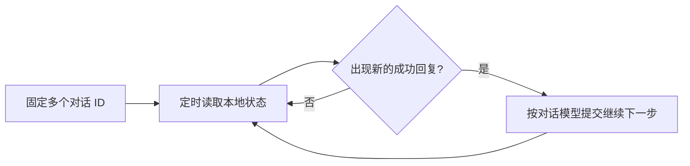

# ZCode Auto Continue

[](LICENSE)
[](https://github.com/murreletfeather/zcode-auto-continue/releases)

**让多个 ZCode 对话在完成一轮后，自动开始下一步。**

这是一个 Windows 图形界面工具：集中选择需要监控的对话，为每个对话指定模型和思考档位，定时检查完成状态，然后发送“继续下一步”。无需重复切换窗口、手动发送相同提示。

[下载 Windows EXE](https://github.com/murreletfeather/zcode-auto-continue/releases/tag/v0.1.0) · [快速上手](#快速上手) · [源码运行](#源码运行) · [实现原理](#实现原理)

> **适用范围：** ZCode 桌面版、本地工作区、Windows x64。当前适配 ZCode 3.14.4，v0.1.0 为预览版本。监控本身不调用模型推理 API；ZCode 执行任务仍会消耗所选模型的额度。

## 你可以用它做什么

| 功能 | 使用方式与行为 |
| --- | --- |
| 多对话集中管理 | Ctrl / Shift 多选对话并加入监控列表；按工作区与对话 ID 锁定，标题变化不会换目标 |
| 每个对话独立选模型 | 从 ZCode 已配置并启用的供应商中选择模型，也可以保留对话原模型 |
| 独立思考档位 | 读取各模型支持的档位，如 low / high / max、disabled / enabled，按对话设置 |
| 每 5 分钟检查 | 默认 300 秒，可自行修改；每次记录状态和下次检查时间 |
| 成功完成后续发 | 发现新的成功回复才发送“继续下一步”；运行中、错误、待确认不发送 |
| 回复去重 | 对末条回复生成指纹，同一个完成结果不会反复触发 |
| 每个对话独立计数 | 分别设置本次监控的续发上限，0 表示不限；重新开始监控会重新计数 |
| 失败隔离 | 一个目标查询或发送失败，只暂停该目标，其他目标继续监控 |
| 保存与自动启动 | 保存目标、模型、档位和检查设置，可选择重开工具自动监控 |
| 路径选择 | 尝试检测常见安装位置与卸载注册表；自定义安装位置可手动选择 ZCode.exe |

**模型在下一次自动续发时生效。** 工具不会中途改变正在执行的任务，也不会修改 ZCode 的全局默认模型。多个已提交任务能否同时运行，取决于 ZCode 与模型供应商的并发限制。

## 快速上手

### 1. 下载并打开

从 [v0.1.0 Release](https://github.com/murreletfeather/zcode-auto-continue/releases/tag/v0.1.0) 下载 `ZCodeAutoContinue-0.1.0-windows-x64.exe`，双击打开。**无需安装 Python。**

不要同时运行旧版工具与新版工具监控同一个对话，以免重复续发。

### 2. 连接 ZCode

- ZCode 本地调试接口已开启：直接打开目标工作区。
- 接口尚未开启：先在 ZCode 中正常退出，再点击工具中的“以本地接口模式打开 ZCode”。
- 未找到安装位置：点击“选择 ZCode 路径”，选择安装目录里的 `ZCode.exe`。

工具不会强行终止你的 ZCode 任务。

### 3. 加入多个对话

在上方列表用 Ctrl / Shift 多选，点击“加入选中对话”。可以输入关键词筛选标题或工作区。

下方列表是实际监控的目标；移除目标只影响监控，不删除 ZCode 对话。

### 4. 给每个目标设置模型

点击“读取可用模型”，在下方选中一个或多个目标，选择模型、思考档位，再点击“应用到选中对话”。

例如，可以给对话 A 选择已配置的 MiniMax，给对话 B 选择 GLM，给对话 C 保留原模型。工具只使用 ZCode 已配置的供应商，不要求另行填写 API Key。

### 5. 开始监控

点击“开始全部监控”。默认检查间隔为 300 秒，每个目标本次续发上限为 20 次。

- 默认只等待新的完成结果，不立即续发历史回复。
- 需要立即开始下一轮：勾选“开始时立即续发已完成对话”。
- 需要重开后自动工作：勾选“下次打开后自动开始”，保存设置。
- 修改目标或模型：先暂停全部，等待日志显示停止后再修改并重新开始。

## 状态怎么看

| 状态 | 工具行为 |
| --- | --- |
| running | 正在执行，等待结束 |
| completed | 检查末条回复是否是新的完成结果，是则续发 |
| error | 错误结束，等待用户恢复任务，不自动重试额度或接口错误 |
| waiting | 等待用户确认，不自动回答 |
| paused / idle | 等待下一次运行 |
| 工具显示“已暂停” | 该目标不再续发，已提交的 ZCode 任务仍继续执行 |

300 秒代表**检查一次**，不是无条件发送一次。未知的提交结果不会自动重试，避免重复启动实际任务。

## 源码运行

要求 Python 3.10+ 且包含 tkinter，当前验证环境为 Python 3.14 / Windows 11 x64。

```powershell
git clone https://github.com/murreletfeather/zcode-auto-continue.git
cd zcode-auto-continue
python -m venv .venv
.venv/Scripts/python.exe -m pip install -r requirements.txt
.venv/Scripts/python.exe multi_continue.py
```

也可以用 `ZCODE_EXE` 环境变量指定安装位置。图形界面里选择并保存的安装路径优先于自动检测。

## 测试与打包

```powershell
.venv/Scripts/python.exe -m pip install -r requirements-dev.txt
.venv/Scripts/python.exe -m unittest -v
node test_discovery.js
.venv/Scripts/python.exe -m PyInstaller --noconfirm --onefile --windowed --name ZCodeAutoContinue-0.1.0-windows-x64 multi_continue.py
```

产物在 `dist/`。发布包使用 PyInstaller 携带 Python、tkinter 与依赖，仓库不提交 EXE 或构建缓存，二进制通过 Releases 分发。

26 项 Python 回归测试覆盖目标锁定、去重、多模型路由、独立计数、失败隔离、暂停、状态变化、配置保存和安装路径检测；另有 React 服务发现夹具测试。已实机验证模型目录读取和单对话自动消息发送。多对话指定模型的真实推理执行尚未额外验证。

## 实现原理



- 只读查询 `~/.zcode/v2/tasks-index.sqlite` 中的任务状态。
- 通过 `127.0.0.1:19387` 的 Chrome DevTools Protocol 访问 ZCode 桌面页面。
- 从 React 服务上下文读取末条助手回复，对回复 ID、正文和时间戳生成 SHA-256 指纹。
- 调用 `sendConversationCommandV4` 的 `sendText` 命令，按需携带 `modelSelection`。
- 每个目标分别记录回复指纹、计数与暂停状态。一个检查周期逐个提交消息，任务执行由 ZCode 处理。

## 配置、隐私与费用

配置保存在用户的 `Documents/ZCodeAutoContinue/` 下，多对话配置文件为 `settings.multi.json`。首次使用可迁移旧版 `settings.json` 中明确保存的目标。

配置包含所选对话身份、模型 ID 和安装路径，**不包含 API Key**。模型目录在 ZCode 页面内过滤凭据，只传回名称、ID 与思考档位。源码和 Release 均不包含个人对话、数据库或诊断快照。

监控不调用推理 API，消耗 0 token；ZCode 收到续发消息后，使用所选模型的额度。

## 已知限制

- 依赖 ZCode 内部接口与 React 结构，升级后可能需要重新适配。
- 当前验证桌面本地工作区；远程主机模型目录尚未验证。
- 本地调试端口可以被本机其他程序访问。正常退出 ZCode 后以普通方式重开，可结束本次调试接口。
- 数据库整体无法读取会结束本次监控，单个目标失败只暂停该目标。
- 暂停工具不会撤回已提交给 ZCode 的消息。
- Release 尚未进行代码签名，首次运行可能出现 Windows 发布者提示。

## 文件与贡献

| 文件 | 用途 |
| --- | --- |
| `multi_continue.py` | 多对话窗口、模型目录与监控状态 |
| `auto_continue.py` | 安装路径检测、本地 CDP 接口、对话查询和消息提交 |
| `test_multi.py` | 多对话、模型路由与路径检测回归测试 |
| `test_monitor.py` | 基础状态与消息接口回归测试 |
| `test_discovery.js` | React 服务发现夹具测试 |

欢迎提交 Issue 和 Pull Request。报告问题时请提供工具版本、ZCode 版本、状态日志与复现步骤，并删除对话正文、密钥和个人路径。

这是独立社区工具，与 ZCode 官方无隶属关系。

## 许可证

[MIT License](LICENSE) © 2026 murreletfeather。

第三方运行库的许可证见 [THIRD_PARTY_NOTICES.txt](THIRD_PARTY_NOTICES.txt)，随 Release 一同提供。
